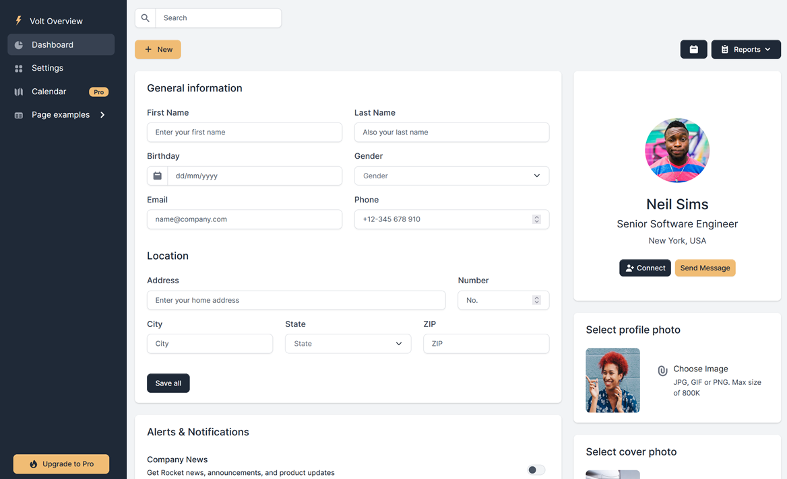

### dash-flightdeck

Python/Dash based Dashboard Template based on
beautiful [Volt](https://demo.themesberg.com/volt/) Bootstrap 5 Template

### Usage

	pip install -r requirements.txt

	python usage.py

or

  python waitress.py

## Volt

The volt distribution is in the folder *./volt* This is just used as a
back reference.

### Building CSS from SASS

    npm install -g sass

Bootstrap v5.1.3 was copied fro the NPM distribution
to *volt\sass\bootstrap*. The bootstrap reference in volt.scss
has been changed.

Building volt.css from sass source

    cd volt/sass
    sass --no-source-map volt.scss ../css/volt.css

    sass --no-source-map volt-tiny.scss ../css/volt-tiny.css

## css2sass

Converted from volt-min.css using [css2sass](https://css2sass.herokuapp.com/)

I need to find a way to programmatically extract colours from the css and assign the to
variables

### Links

* [Volt Bootstrap 5 Dashboard](https://demo.themesberg.com/volt/)
* [github](https://github.com/themesberg/volt-bootstrap-5-dashboard)
* [demo](https://demo.themesberg.com/volt/pages/dashboard/dashboard.html)