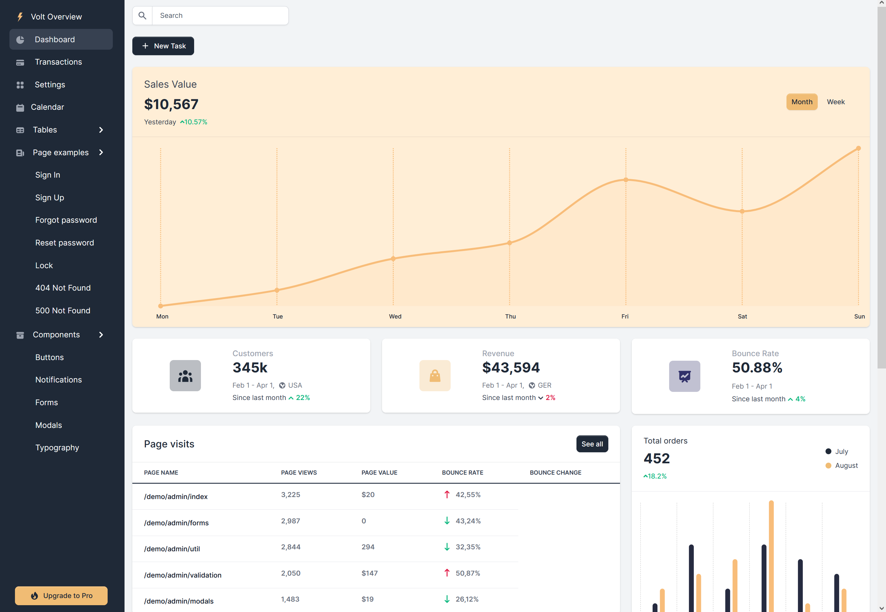

### dash-flightdeck



[Plotly/Dash] based clone of the the beautiful [Volt](https://demo.themesberg.com/volt/) Bootstrap 5 dashboard template.

**dash-flightdeck** Is 100% python, it demonstrates how a rich UI experience can be easily
created using [DashSPA] components and patterns.

**dash-flightdeck** Shows how easy it is to create great looking tables with optional search and pagination. Table cells
can contain text and/or active Dash components. Table, search and pagination component layout is completely flexible.


```
class TrafficTable(BasicTable):

    def tableRow(self, index, args):

        cid, ts, st, cat, rank, share, change = args.values()

        return html.Tr([
            html.Td([
                html.A(cid, href='#', className='text-primary fw-bold')
            ]),
            html.Td([
                icons[ts],
                ts
            ], className='fw-bold d-flex align-items-center'),
            html.Td(st),
            html.Td(cat),
            html.Td(rank),
            progressBar(share),
            self.numberAndArrow(change)
        ])
```


### Usage

    pip install -r requirements.txt

    python app.py

or

    python waitress_server.py

* [Plotly/Dash]
* [Volt]
* [DashSPA]


[Plotly/Dash]: https://dash.plot.ly/introduction
[Volt]: https://demo.themesberg.com/volt/
[DashSPA]: https://github.com/stevej2608/dash-spa